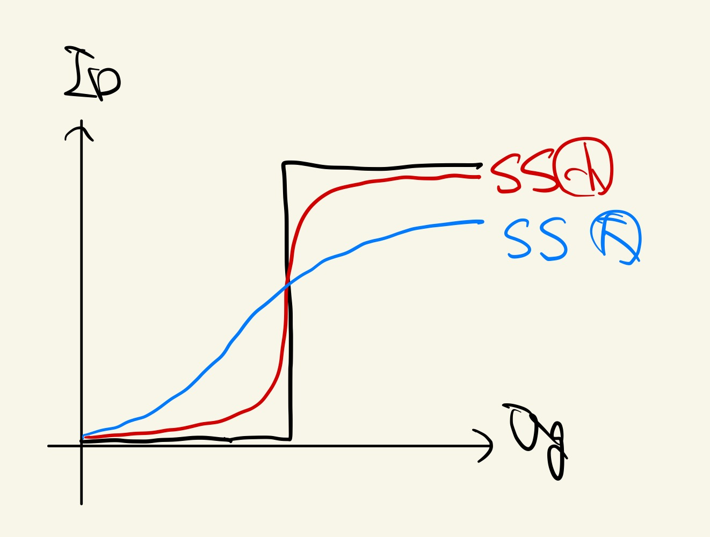

# 18: 半導体 MOFSET

# 考察課題(3)メモ

HFO2 と Si の間にトラップがあると、

$$
\mathrm{SS} = (\log_{e}10)\frac{kT}{q}\left(1 + \frac{C_0}{C_{ox}}\right)
$$

だったものが、

$$
\mathrm{SS} = (\log_{10})\frac{kT}{q}\left(1 + \frac{C_0 + C_{\mathrm{it}}}{C_{\mathrm{ox}}}\right)
$$

のように、容量$C_{it}$が並列接続されたような状態になるため、SS は大きくなる。

下のような原理より、**SS が大きいとサブスレッショルドスロープの劣化が大きい**ため、トラップがあるとサブスレッショルドスロープは劣化する。

また、サブスレッショルドスロープの理論限界値を決めるのは、同様に上の式で

$$
\mathrm{SS} = (\log_{10})\frac{kT}{q}\left(1 + \frac{C_0}{C_{ox}}\right)
$$

この$C_0 / C_{ox}$が 0 より大きいことから、$SS$は

$$
\mathrm{SS}_{\mathrm{limit}} = (\log_{e}10)\frac{kT}{q}
$$

よりも小さくならないことに起因する。(課題の「物理メカニズム」)

### 参考

昭晃堂 - 「半導体デバイス入門 -その原理と動作のしくみ-」(柴田 正 著)…SS の

- [x] Hf の方もできればよい
